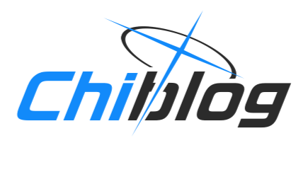

# chiblog

## A light, concise and pluggable blogging platform frontend

## recommended configuration file editor: [chiblog-editor](https://github.com/chi-net/chiblog-editor)

## Fast-use (Deploy in Docker/Podman):

> Tips: [Podman](https://podman.io/) is strongly recommended rather than Docker, futher information: <https://blog.chihuo2104.dev/posts/comment-fixed-and-hi-podman> (Chinese Simplified Only).

```shell
podman run -dit -p 3000:3000 --name my-chiblog-container -e NUXT_CHIBLOG_CONFIG_TYPE=production -e NUXT_CHIBLOG_CONFIG_URL=myurl ghcr.io/chi-net/chiblog
```

use docker instead:

```shell
docker run -dit -p 3000:3000 --name my-chiblog-container -e NUXT_CHIBLOG_CONFIG_TYPE=production -e NUXT_CHIBLOG_CONFIG_URL=myurl ghcr.io/chi-net/chiblog
```

And `.env` file is also available to define an environment variable.

## Environmental Variables


| Name | Description | Required | 
|-------------|------------|------|
| NUXT_CHIBLOG_CONFIG_TYPE | configuration type for chiblog(mocks/production) | True |
| NUXT_CHIBLOG_CONFIG_URL | if the config type is 'production', it provides the server with your production JSON path | Optional |
| NUXT_CHIBLOG_AI_API_KEY | if you want to use the AI option, in order to guard your API secret key, you have to pass it through the environmental variables | Optional |
| NUXT_CHIBLOG_IGNORE_BETA_TIPS | ignore BETA warning tip | Optional |

If you want to try dev version, just add a `dev` tag!

## This application is licensed under [GPL-3](LICENSE) license.

## Debug and develop this application

We use `pnpm` as our package manager.

Install Dependencies: `pnpm i`

Generate Static Site: `pnpm generarte`

Open a Develop Server: `pnpm dev`

Build This Application to SSR: `pnpm build`


## More Documentation is in <https://chiblog.chinet.work/>
